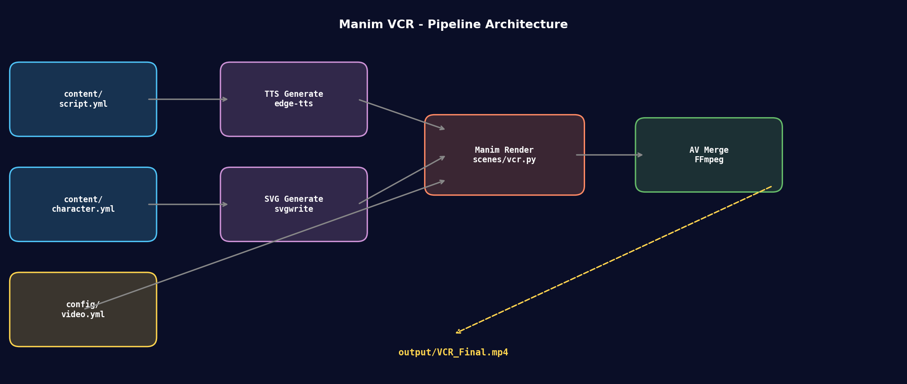
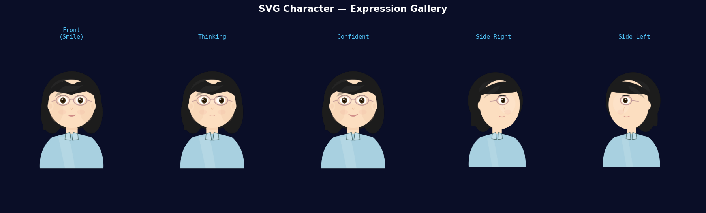

<h1 align="center">Manim VCR</h1>

<p align="center">
  <em>Programmatic video resume creation with Manim, SVG characters, and AI narration.</em>
</p>

<p align="center">
  
  
  
  
  
</p>

---

## Demo

https://github.com/user-attachments/assets/3b7935ea-c418-4053-812f-01e47596a821

> *60-second video resume: AI-themed personal showcase with programmatic SVG character and bilingual subtitles.*

---

## Key Features

- **Programmatic SVG Characters** — Pure Python generates multi-expression, multi-pose cartoon avatars. No external design tools needed.
- **Data-Driven Animation** — All dialogue, timing, and visual parameters are driven by YAML config. Change the config, get a new video.
- **AI Narration Pipeline** — `edge-tts` auto-generates multi-segment voiceover, precisely aligned to subtitle timeline.
- **Bilingual Subtitles** — English primary + Chinese secondary subtitles, frame-accurate sync.
- **One-Command Build** — `make all` or `docker compose run manim make all` runs the full pipeline.
- **Docker-Ready** — Pre-configured Xvfb + Mesa + FFmpeg + TeX Live headless rendering environment.

---

## Architecture

<p align="center">
  
</p>

| Stage | Script | Input | Output |
|-------|--------|-------|--------|
| 1. Character | `scripts/01_generate_character.py` | `content/character.yml` | `character/*.svg` |
| 2. TTS | `scripts/02_generate_tts.py` | `content/script.yml` | `audio/*.mp3` + `audio/timing.json` |
| 3. Render | `manim -pqh scenes/vcr.py VCR` | `scenes/vcr.py` + SVGs | `media/.../VCR.mp4` |
| 4. Merge | `scripts/04_merge.py` | video + audio + BGM | `output/VCR_Final.mp4` |

---

## SVG Character Gallery

<p align="center">
  
</p>

Five expression/pose variants generated entirely in Python using `svgwrite` — no Figma, no Illustrator.

---

## Quick Start

### Prerequisites

- Python 3.10+
- FFmpeg
- LaTeX (`texlive-full` recommended for Manim)

### Installation

```bash
git clone https://github.com/0010Grent/manim-vcr.git
cd manim-vcr
pip install -r requirements.txt
```

### Create Your Video

1. Edit `content/script.yml` — fill in your dialogue, timing, and Chinese subtitles
2. Edit `content/character.yml` — customize skin tone, hair color, accessories
3. (Optional) Drop a BGM file into `audio/bgm_trimmed.mp3` or `content/bgm/`
4. Run the pipeline:

```bash
make all
# or step by step:
make character   # generate SVGs
make tts         # generate voiceover
make render      # render Manim animation
make merge       # merge video + audio
```

Output: `output/VCR_Final.mp4`

### Docker (Recommended for clean environments)

A pre-built image is available on Docker Hub — no local build needed:

```bash
docker compose run --rm manim make all
```

> The image `thisis0010grent/manim-vcr:latest` will be pulled automatically on first run.

---

## Configuration

### `content/script.yml` — Dialogue & Timeline

```yaml
segments:
  - id: s01
    en: "She teaches AI to think."
    cn: "她教AI思考。"
    rate: "-10%"       # TTS speech rate adjustment
    video_start: 0.30  # seconds into the video when this line starts
```

### `content/character.yml` — Avatar Appearance

```yaml
skin: "#FCDEC0"
hair: "#1C1C1C"
glasses_frame: "#C09898"
shirt: "#A8D0E0"
expressions:
  - front
  - thinking
  - confident
  - side_left
  - side_right
```

### `config/video.yml` — Video Parameters

```yaml
video:
  width: 1920
  height: 1080
  fps: 60
  total_duration_s: 62

audio:
  tts_voice: "en-US-AndrewNeural"
  bgm_volume_db: -11
  bgm_fade_in_ms: 2000
```

---

## Tech Stack

| Component | Technology |
|-----------|------------|
| Animation Engine | [Manim Community](https://www.manim.community/) 0.20.1 |
| Character Rendering | [svgwrite](https://svgwrite.readthedocs.io/) (programmatic SVG) |
| TTS | [edge-tts](https://github.com/rany2/edge-tts) (Azure Neural Voice) |
| Audio Processing | [pydub](https://github.com/jiaaro/pydub) + FFmpeg |
| Container | Docker + Xvfb + Mesa OpenGL |
| Config | PyYAML |

---

## Project Structure

```
manim-vcr/
├── content/          # ← EDIT THIS to create your own video
│   ├── script.yml    # dialogue + timeline
│   ├── character.yml # avatar appearance
│   └── example/      # reference examples
├── config/
│   └── video.yml     # video/audio parameters
├── core/             # reusable framework engine
│   ├── character_builder.py
│   ├── tts.py
│   ├── merge.py
│   ├── timing.py
│   ├── subtitle.py
│   └── theme.py
├── scenes/
│   └── vcr.py        # main Manim scene
├── scripts/          # step-by-step pipeline scripts
├── showcase/         # demo assets (video, diagrams)
└── Dockerfile        # headless rendering environment
```

---

## Customization

See [docs/CUSTOMIZATION.md](docs/CUSTOMIZATION.md) for a step-by-step guide on creating your own video resume.

See [docs/DEVELOPMENT.md](docs/DEVELOPMENT.md) for environment setup, debugging tips, and contributing guidelines.

---

## License

MIT © 2026 [Yao Fu](https://github.com/0010Grent)

---

## Acknowledgments

- [Manim Community](https://www.manim.community/) for the animation engine
- [3Blue1Brown](https://github.com/3b1b/manim) for the original manimgl inspiration
- [Microsoft Edge TTS](https://github.com/rany2/edge-tts) for neural voice synthesis
